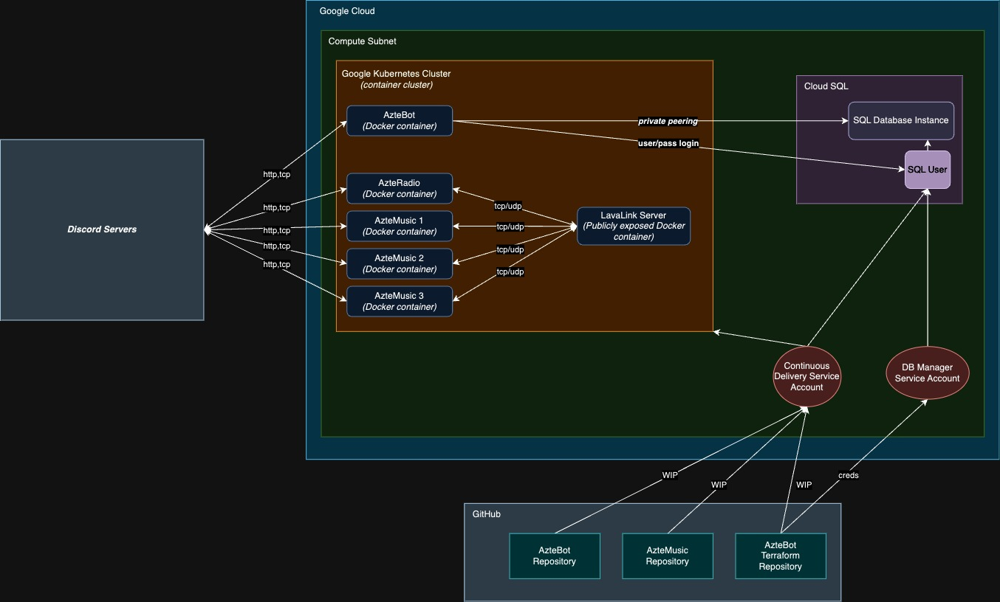

# Aztebot-Infrastructure
Google Cloud infrastructure declared using Terraform for the OTA bot service apps, ranging from the AzteBot, to the music orchestrators, and the AzteMarket.

# Cloud Infrastructure Diagram

_Note that the diagram above might get outdated._